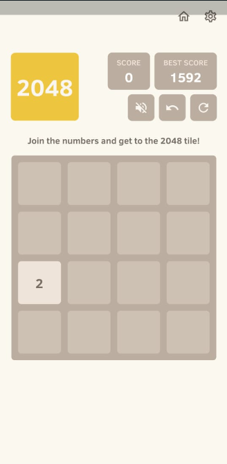

# 2048

2048 is a classic puzzle game implemented in C# using Windows Forms. This repository contains the source code, custom graphics, and sound effects for a desktop version of the game.

## Features
- Smooth tile movement and merging logic
- Custom graphics for tiles and UI elements
- Sound effects and background music (requires NAudio)
- Undo and reload functionality

## Materials
All images used in the game are located in the `materials/` folder:

```
materials/
├── 2.png, 4.png, 8.png, 16.png, 32.png, 64.png, 128.png, 256.png, 512.png, 1024.jpg, 2048.png
├── mute.png, unmute.png, reload.png, undo.png, map.png, whole.png
```

## Getting Started
To run or modify the game, open the source file in Visual Studio, add the images from `materials/`, and install the NAudio NuGet package for sound support.

## Credits
- All graphics and sound effects are custom-made for this project.
- Game logic inspired by the original 2048 by Gabriele Cirulli.

---
Enjoy playing and learning from this implementation!

## Preview
Below is a preview of the game board:


